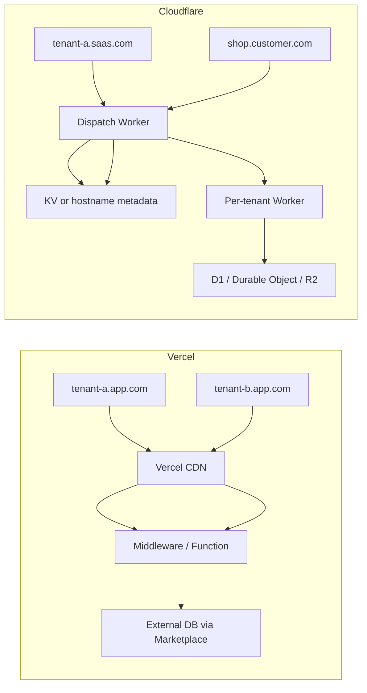

# Vercel vs Cloudflare for App Backend Services

## Executive summary

Vercel and Cloudflare overlap on modern app hosting, serverless APIs, edge delivery, and AI-adjacent tooling, but they are optimized for different backend philosophies. Vercel is strongest when the application is primarily a full-stack web app with a frontend-led workflow: Git-based previews, branch environments, strong framework ergonomics, broad function runtime support, and a polished path for shipping Next.js and AI-enabled product features quickly. Cloudflare is strongest when the backend itself is the product surface: globally distributed APIs, low-latency routing, stateful edge coordination, custom-domain-heavy multi-tenant SaaS, untrusted code execution, and integrated native services such as D1, KV, Durable Objects, R2, Vectorize, and Workers AI. citeturn9search0turn9search3turn30search0turn14search1turn32view1turn33view2turn34view3turn20search6turn20search17

The single clearest structural difference is the data plane. Vercel’s first-party storage story is centered on Blob and Edge Config, while SQL, Redis, and vector storage are primarily delivered through Marketplace partners such as Neon, Supabase, MongoDB Atlas, Upstash, and others. Cloudflare, by contrast, provides first-party backend primitives directly on the platform: KV for globally cached key-value access, D1 for serverless SQL on SQLite with global read replication and point-in-time restore, Durable Objects for strongly consistent colocated state, R2 for object storage with free egress, Hyperdrive for global acceleration to external databases, and Vectorize for native vector search. citeturn22search1turn22search3turn21search2turn34view0turn34view1turn34view3turn34view4turn27view3turn34view7turn20search6turn27view5

Authentication is also asymmetric. Neither platform is a full-fledged built-in customer identity platform in the same way as Auth0, Clerk, or Cognito, but Cloudflare has a much richer first-party edge access and identity-control layer through Access, JWT validation, service tokens, mTLS, and multi-domain session behavior. Vercel’s first-party auth surface is mostly team access, deployment protection, SAML/Directory Sync for organization access, Sign in with Vercel, and integration patterns with third-party app auth providers. citeturn17search2turn17search1turn18search0turn18search1turn18search2turn18search3turn18search0turn18search1turn7search1turn7search2turn7search4turn7search12turn24search4turn24search9

On economics, Cloudflare is usually materially cheaper for bandwidth-heavy, API-heavy, or custom-domain-heavy backends because Workers pricing has no egress charge and R2 has no Internet egress charge, while Vercel monetizes fast data transfer and pushes much of the database layer to third-party providers. Vercel can still be the better business choice when deployment velocity, previews, frontend ergonomics, and framework integration are the dominant constraints rather than raw backend unit economics. citeturn26search0turn27view8turn27view9turn37view4turn27view1turn27view3turn22search1

## Platform shape and core tradeoffs

A concise way to frame the comparison is this: Vercel is an application platform with backend capabilities attached to a world-class frontend deployment workflow, while Cloudflare is a distributed backend platform that also hosts full-stack applications well. That distinction shows up repeatedly in data services, routing, tenant isolation, and pricing. citeturn13search15turn9search3turn32view1turn33view2

| Dimension | Vercel | Cloudflare | Analytical read |
|---|---|---|---|
| Core strength | Preview-driven full-stack app delivery, especially with Next.js and web teams | Edge-native backend services, routing, security, and globally distributed compute | Vercel skews product-engineering workflow; Cloudflare skews distributed systems/platform engineering |
| Native backend data | Blob and Edge Config first-party; SQL/KV/vector mainly via Marketplace partners | KV, D1, Durable Objects, R2, Hyperdrive, Vectorize are native | Cloudflare has the denser first-party backend substrate |
| Runtime model | Regional Functions with Fluid Compute; multiple runtimes including Node, Bun, Python, Rust, Go, Ruby, Wasm | V8 isolates on the global network; JS/TS/Python/Rust/Wasm and more via Workers tooling | Vercel wins on broad runtime menu; Cloudflare wins on edge-execution model |
| Multi-tenant custom domains | Strong wildcard/subdomain support; large soft domain limits; common SaaS patterns well supported | Native “millions of vanity domains” routing with dispatch Workers and Cloudflare for SaaS | Cloudflare is stronger for large-scale hostname orchestration |
| Tenant code isolation | Sandbox product and some enterprise security features; app isolation is not a per-tenant Worker primitive | Workers for Platforms and untrusted namespaces provide explicit per-tenant compute separation | Cloudflare is more natural for programmable platforms and user code |
| AI posture | AI Gateway, AI SDK, provider routing/fallbacks, embeddings, workflows; model access is gateway-centric | Workers AI, Agents, Vectorize, Durable Objects, AI Gateway, Containers/Sandbox; inference and state can live on one network | Vercel favors model portability and app DX; Cloudflare favors native agent infrastructure |

Table sources: Vercel docs and pricing pages describe preview environments, runtimes, wildcard domains, Marketplace storage, AI Gateway, Workflows, Sandbox, and Enterprise features; Cloudflare docs describe Workers, Workers for Platforms, hostname routing, D1, Durable Objects, R2, Vectorize, Workers AI, and Access. citeturn9search0turn9search3turn30search0turn10search0turn15search0turn22search1turn21search5turn21search1turn16search7turn26search0turn32view1turn33view0turn33view2turn34view3turn34view4turn27view3turn20search6turn20search17turn7search4

## Detailed comparison across backend dimensions

### Databases and state

Vercel’s first-party storage lineup is intentionally narrow. The native products surfaced in current docs are Blob for object storage and Edge Config for global low-latency configuration data. Edge Config is optimized for read-heavy global access, with the vast majority of reads completing within 15 ms at P99 and often less than 1 ms, and Vercel explicitly positions it for feature flags, redirects, and frequently read but infrequently updated data. Blob is distributed from 20 regional hubs and is positioned for media and large assets, not as a transactional database. For relational, KV, NoSQL, and vector storage, Vercel directs users to Marketplace integrations such as Neon, Supabase, Aurora Postgres, MongoDB Atlas, Upstash, Turso, and others. That means the database layer on Vercel is usually composable rather than native. citeturn35search0turn14search11turn14search15turn22search1turn22search3turn21search2

Cloudflare’s native data plane is much broader. Workers KV is a global low-latency key-value store, but Cloudflare’s own docs note that data is stored in a small number of centralized data centers and then cached out to edge locations after access, which makes KV excellent for cached reads and configuration but not the platform’s strongest primitive for strict write consistency. D1 is Cloudflare’s serverless SQL database built on SQLite; it supports global read replication and Time Travel restores to any minute within the last 30 days. Durable Objects add a different class of primitive: each object combines compute and attached storage, with strongly consistent colocated state private to that object. R2 provides S3-compatible object storage with no Internet egress charges, Hyperdrive accelerates access to external databases through edge connection setup, pooling, and query caching, and Vectorize provides native globally distributed vector search. citeturn34view0turn5search0turn34view1turn34view2turn34view3turn34view4turn34view7turn34view8turn27view3turn20search6turn27view5

The practical implication is important. If your application needs a traditional app database such as Postgres, Vercel is usually paired with an external serverless Postgres vendor and can work very well, especially when you deliberately place functions near data by selecting one of Vercel’s 20 compute regions. If your application needs edge-read-heavy SQL, object storage without egress penalties, or actor-like coordination primitives for chat rooms, collaborative state, or per-tenant coordination, Cloudflare’s first-party primitives are more opinionated and more integrated. Hyperdrive further narrows the gap when you want to keep an external Postgres/MySQL system but still need global query acceleration. citeturn14search0turn14search9turn22search1turn34view1turn34view4turn34view7turn34view9

| Database and state area | Vercel | Cloudflare | Assessment |
|---|---|---|---|
| First-party relational DB | No first-party Postgres in the reviewed docs; Postgres is via Marketplace partners | D1 is first-party serverless SQL on SQLite | Cloudflare has the native advantage; Vercel is partner-led |
| Edge/global config store | Edge Config, globally replicated, designed for ultra-fast reads | KV, global cached reads with eventual-consistency tradeoffs | Edge Config is better for “global config”; KV is broader but consistency is looser |
| Strongly consistent stateful coordination | No direct first-party equivalent to Durable Objects | Durable Objects combine compute + strongly consistent private storage | Clear Cloudflare differentiator |
| Object storage | Blob | R2 | R2 is materially more attractive for hot egress-heavy storage because Internet egress is free |
| Native vector DB | None surfaced first-party; use Marketplace providers | Vectorize | Cloudflare wins on native AI retrieval plane |
| External DB acceleration | Function region placement and app-level pooling | Hyperdrive: edge connection setup, pooling, caching, optional placement | Cloudflare’s external-DB story is more explicit and more globally optimized |

Table sources: citeturn21search2turn22search1turn35search0turn14search11turn14search15turn34view0turn34view1turn34view3turn34view4turn34view7turn27view3turn20search6

### Authentication and identity

Vercel does not currently present a built-in customer identity service for your end users in the reviewed official docs. Instead, it leans on integrations and templates around Auth0, Clerk, NextAuth.js/Auth.js, and Supabase Auth. What Vercel *does* provide directly is deployment access control, organization/team identity features, and OAuth-style integration patterns. Deployment Protection supports Vercel Authentication, password protection, and trusted IPs for preview and production URLs. Team SAML SSO is available on Enterprise and as a Pro add-on, and Directory Sync is Enterprise-only. “Sign in with Vercel” is an OAuth-style flow with PKCE, cookies, access tokens, and refresh tokens, but it authenticates users against Vercel identities rather than acting as a generic end-user auth product for your SaaS. citeturn17search2turn17search1turn18search0turn18search1turn18search2turn18search3turn18search4turn18search1turn26search0

Cloudflare’s first-party auth/control surface is much deeper, but it is best understood as edge access and Zero Trust policy rather than a customer IAM database. Cloudflare Access supports all SAML and OIDC providers and most OAuth providers, and can also use one-time PINs. It issues JWTs that can be validated at your app edge, supports service tokens for machine-to-machine access, supports mTLS-based service auth, and can share application cookies across multiple domains within the same Access application. Session behavior is configurable by application or policy, and Cloudflare’s security stack around auth can be augmented with Turnstile, WAF, Bot Management, and API Shield. citeturn7search4turn24search9turn7search1turn7search2turn7search5turn7search12turn7search18turn7search17turn12search15turn12search19

The most useful decision rule is this: if you need workforce SSO, preview protection, internal admin access, machine-to-machine auth, or edge-enforced access policies, Cloudflare is materially stronger out of the box. If you need consumer/customer auth, both platforms typically end up integrated with an external auth system, but Vercel’s ecosystem and starter templates make that integration particularly smooth for web-app teams. citeturn17search2turn17search1turn18search0turn7search4turn7search1turn7search2turn24search4

| Auth dimension | Vercel | Cloudflare | Assessment |
|---|---|---|---|
| Built-in end-user auth for your SaaS | No dedicated first-party customer IAM surfaced; relies on integrations/templates | No classic customer IAM either, but rich edge auth controls | Both usually need third-party customer auth for SaaS user stores |
| Team/org SSO | SAML SSO; Directory Sync on Enterprise | SSO through Access with SAML/OIDC/OAuth IdPs | Cloudflare is broader on auth policying; Vercel is narrower and org-centric |
| Machine/service auth | OIDC tokens for some Vercel services/integrations | Service tokens, mTLS, JWT validation | Cloudflare stronger |
| Session management | Mostly app-defined unless using specific feature flows | Per-app/per-policy control, Access tokens/cookies/JWTs | Cloudflare stronger |
| Preview access control | Strong and simple through Deployment Protection | Possible through Access on preview URLs | Vercel has the smoother default app workflow |

Table sources: citeturn17search1turn18search0turn18search1turn18search2turn18search3turn18search4turn7search4turn7search1turn7search2turn7search5turn7search12turn7search18turn24search4turn24search9

### APIs, runtimes, observability, and developer workflows

Vercel Functions support a notably wide runtime set in the current docs: Node.js, Bun, Python, Rust, Go, Ruby, and Wasm. Node 24.x is the default Node.js line, with 22.x and 20.x also available. Several non-Node runtimes are still marked beta. Vercel’s Fluid Compute model is optimized for active CPU billing, provisioned memory billing, and optimized concurrency so multiple invocations can share an instance. Vercel also documents bytecode caching for Node 20+ cold-start improvements in production. Function execution is regional rather than “run everywhere by default,” which is often a good fit for app servers that need to stay close to a primary database. citeturn30search0turn30search5turn30search1turn30search2turn30search3turn14search5turn28view0turn28view1turn14search0

Cloudflare Workers use V8 isolates, and Cloudflare’s architecture docs explicitly contrast this with VM/container-per-function models: isolates are lightweight, start very quickly, and avoid VM-style cold starts. Workers support JavaScript, TypeScript, Python, Rust, and more via WebAssembly and the Workers toolchain. On the paid plan, the default CPU limit is 30 seconds and can be increased up to 5 minutes. Cloudflare’s observability stack includes metrics, logs, tracing with automatic instrumentation for bindings, Tail Workers, and query tooling. For local development, Cloudflare provides Wrangler plus Miniflare/workerd-based local simulation, with the option to bind to local simulations or real remote resources during development. citeturn32view0turn32view1turn32view2turn32view3turn32view4turn8search7

The developer workflow difference is also quite real. Vercel’s default deployment story is Git-first: every commit or PR can create a preview deployment, preview deployments can be promoted to production, custom preview suffixes are supported, and the overall workflow is highly tuned for web teams. Cloudflare is stronger when your platform engineering team wants explicit control: Wrangler, Workers Builds or external CI/CD, versioned and aliased preview URLs, rollbacks, version overrides, and local simulation via workerd/Miniflare. citeturn9search0turn9search3turn9search5turn9search1turn32view5turn32view6turn8search1turn8search21

| API/runtime dimension | Vercel | Cloudflare | Assessment |
|---|---|---|---|
| Official runtimes | Node, Bun, Python, Rust, Go, Ruby, Wasm | JS/TS, Python, Rust, Wasm, plus broader Workers ecosystem | Vercel is more language-diverse out of the box |
| Cold-start posture | Improved by Fluid Compute and bytecode caching, but still regional function instances | Isolate model explicitly avoids VM cold starts | Cloudflare has the architectural edge on cold starts |
| Maximum CPU/duration | Node limits vary by plan/runtime; configurable durations; Fluid Compute changes limits and billing model | Paid Workers default 30s CPU, up to 5m | Both can handle substantial API work; fit depends on code/runtime assumptions |
| Observability | Built-in observability, queries, dashboards, optional Observability Plus add-on | Built-in metrics, tracing, Tail Workers, query tooling | Roughly comparable at a high level; Cloudflare’s platform telemetry is very mature |
| DX default | App-team oriented, Git-native previews and promotion | Platform-engineering oriented, Wrangler + versions + preview URLs | Vercel usually feels faster for product teams; Cloudflare for infra-heavy teams |

Table sources: citeturn30search0turn30search1turn30search2turn30search3turn30search5turn14search5turn28view0turn32view0turn32view2turn32view3turn32view4turn32view6turn9search0turn9search3turn8search1

### Domain routing, custom domains, and multi-tenant SaaS

Vercel fully supports custom domains and wildcard domains, and its limits page documents soft ceilings of 100,000 domains per project on Pro and 1,000,000 on Enterprise. Wildcard domains are straightforward for subdomain-based SaaS patterns such as `*.acme.com`, and Vercel’s docs explicitly point users to multi-tenant SaaS templates and starter kits. There is one important operational caveat: for wildcard SSL issuance, Vercel uses DNS-01 and requires the nameservers to be on Vercel. Routing decisions on the Vercel CDN are evaluated before cache lookup, and the platform supports redirects, rewrites, and header rules. citeturn10search0turn10search2turn15search0turn10search4turn28view6turn10search16

Cloudflare’s routing model is more expressive when the application itself is a multi-tenant platform. Workers can use Routes when a Worker sits in front of an origin, or Custom Domains when the Worker is the origin. For SaaS providers, Workers for Platforms plus Cloudflare for SaaS can route millions of vanity domains or subdomains through a dispatch Worker without route-limit pain, then hand traffic to per-tenant Workers. Custom hostnames support certificate-management choices, wildcard SAN behavior, CA selection, and custom origin configuration. In untrusted mode, tenant Workers get stronger isolation, including isolated cache behavior that reduces cross-tenant leakage risk. citeturn33view4turn33view5turn33view0turn33view1turn33view2turn33view3

The diagram reflects official patterns in each vendor’s docs: wildcard or subdomain routing on Vercel; dispatch-worker hostname routing plus custom hostnames on Cloudflare. citeturn10search0turn10search2turn33view0turn33view1turn33view2

If your multi-tenant app mostly uses subdomains that *you* control, both platforms can work well. If the app needs customer vanity domains at very large scale, programmable hostname dispatch, or per-tenant code/runtime isolation, Cloudflare is materially more natural. If the app needs branch previews, product review URLs, and a fast developer loop for a classic web SaaS, Vercel’s workflow is still excellent and often simpler. citeturn15search0turn9search0turn33view0turn33view2

### AI agents, AI services, sandboxes, performance, security, and support

Vercel’s AI stack is gateway-first. AI Gateway provides a unified endpoint to hundreds of models, with budgets, usage monitoring, load balancing, fallbacks, web search, embeddings, and no markup on provider pricing, including BYOK use. Vercel Workflows is positioned as a durable platform for building long-running applications and AI agents in JavaScript, TypeScript, and Python. Vercel Sandbox is a dedicated isolated execution environment for untrusted or AI-generated code, with Node and Python runtimes, OIDC authentication, runtime limits up to five hours on paid plans, and a network firewall specifically intended to prevent data exfiltration. What Vercel does *not* expose in the reviewed public docs is a general-purpose native model-hosting or public GPU-compute product for your own arbitrary inference runtime; the AI story is primarily provider orchestration plus application tooling. citeturn21search5turn21search0turn21search3turn35search1turn16search7turn16search14turn27view7turn16search11

Cloudflare’s AI story is more vertically integrated. Workers AI runs hosted open-source models on Cloudflare’s network and is explicitly backed by serverless GPUs. The Agents platform runs each agent on a Durable Object with its own SQL database, WebSocket connections, and scheduling, and Cloudflare states that these can scale to tens of millions of instances. Vectorize provides native vector storage; AI Gateway adds observability, caching, rate limiting, authenticated gateways, and fallbacks for upstream providers; Sandbox SDK and Containers provide isolated code execution and any-language runtime packaging; and Sandbox security docs state that each sandbox runs in its own VM for strong isolation. citeturn20search17turn23search21turn6search16turn6search7turn20search6turn6search21turn6search9turn23search2turn23search6turn23search7

On global performance, the numbers are directionally different as well. Vercel documents 126 PoPs across 51 countries and 20 compute-capable regions, with private low-latency networking between PoPs and regions. Cloudflare’s enterprise material and reference architecture describe a network spanning more than 330 cities and operating within roughly 50 ms of around 95% of the Internet-connected population, and Hyperdrive plus Smart Placement are explicitly designed to reduce database latency by moving execution and connection setup closer to data. That makes Cloudflare particularly strong for globally distributed API backends, while Vercel is strong for CDN-delivered applications whose dynamic layer can live in selected regions close to their databases. citeturn28view6turn14search1turn14search9turn25search0turn11search3turn32view1turn34view9turn34view7

Security and compliance are both strong, but shaped differently. Vercel includes WAF, DDoS mitigation, automated HTTPS, and bot/security controls across plans, with Enterprise features such as managed WAF rulesets, multi-region compute and failover, Directory Sync, and a 99.99% SLA. Its pricing page and compliance material list SOC 2 Type II, PCI DSS, ISO 27001, EU-U.S. DPF, and a HIPAA BAA add-on. Cloudflare adds substantial edge-network security depth: WAF managed rules, DDoS protection, rate limiting, Turnstile, Bot Management, API Shield, and the Data Localization Suite for controlling where keys, decrypted traffic processing, and metadata/logs are handled. Cloudflare Trust Hub lists ISO 27001, ISO 27701, PCI DSS, and SOC 2 Type II materials, and its enterprise support pages advertise 24/7/365 support with a 100% uptime guarantee and 25x reimbursement SLA. citeturn28view6turn26search0turn14search10turn12search3turn12search1turn12search19turn12search15turn35search2turn35search4turn35search9turn12search0turn25search6turn25search0

## Pricing analysis

The pricing comparisons below use official self-serve/public pricing where available and intentionally separate platform-controlled costs from vendor-dependent partner costs. The largest caveat is Vercel’s database layer: because relational, Redis, and vector databases are typically Marketplace-partner services rather than first-party platform services, I do **not** include a Vercel SQL/KV/vector line item in the core platform subtotals. That omission is itself strategically important: Cloudflare’s first-party backend bill is more complete, while Vercel often has a second spend surface through external providers. AI is also hard to normalize because Vercel AI Gateway is provider-pass-through and Cloudflare Workers AI is billed in neurons rather than wall-clock hours. citeturn22search1turn26search0turn36search0turn27view4

### Official pricing anchors

| Service | Vercel public pricing | Cloudflare public pricing | What this means |
|---|---|---|---|
| Entry paid plan | Pro: $20/month, with $20 included usage credit | Workers Paid: $5/month minimum | Cloudflare’s floor is much lower |
| Core compute | Functions billed by active CPU, provisioned memory, and invocations; invocations over 1M are $0.60/M | Workers Standard includes requests + CPU billing; example pricing shows $0.30/M requests over included usage and $0.02/M CPU ms over included usage | Cloudflare usually wins on API-heavy workloads |
| Delivery / egress | 10M edge requests and 1TB fast data transfer included on Pro, then ~$2/M edge requests and ~$0.15/GB fast data transfer | Workers pricing states no egress charge; R2 also has free Internet egress | Cloudflare is structurally advantaged for response-heavy backends and object delivery |
| SQL DB | Partner-dependent via Marketplace | D1: first 25B rows read + 50M rows written + 5GB included, then $0.001/M reads, $1/M writes, $0.75/GB-month storage | Cloudflare’s first-party SQL economics are transparent |
| Object storage | Blob: $0.023/GB-month storage, $0.05/GB data transfer, plus operations and standard CDN-origin behavior on misses | R2 Standard: $0.015/GB-month, $4.50/M Class A, $0.36/M Class B, free egress | R2 is usually more favorable for delivery-heavy assets |
| Sandboxes / containers | Sandbox: $0.128/hour active CPU and $0.0212/GB-hour memory on paid tiers | Containers: included quotas on Workers Paid, then CPU/memory/disk metering | Both are separately metered compute surfaces |
| AI gateway / inference | AI Gateway has no markup; provider list pricing applies; free credit exists before switching to paid credits | Workers AI: $0.011 per 1,000 neurons above the daily free allocation | AI must be modeled per provider/workload, not generically |

Table sources: citeturn26search0turn15search3turn27view8turn27view9turn37view4turn27view1turn27view2turn27view3turn27view6turn27view7turn23search1turn36search0turn27view4

### Scenario assumptions

The following scenarios model **backend** traffic, not full static-site traffic. For Vercel, I assume a regional Function in `iad1` with 512 MB memory, average active CPU per request of 20 ms, and average function instance lifetime of 300 ms including I/O wait. For Cloudflare, I assume average Workers CPU time per request of 10 ms in the first two scenarios and 12 ms in the largest scenario. For Cloudflare storage, I use D1 and R2 Standard. For Vercel, partner-managed SQL/Redis/vector storage is not included. AI is broken out separately because hour-based comparison is not how the official pages bill usage. citeturn28view0turn28view1turn32view2turn27view2turn27view3turn27view4

| Scenario | Traffic and compute assumptions | Data assumptions |
|---|---|---|
| Small startup | 1.5M dynamic backend requests/month, peak ~5 RPS, 200 GB/month response transfer | SQL: 10 GB, 20M rows read, 1M rows written; object storage: 50 GB, 0.5M write-class ops, 5M read-class ops |
| Mid-size app | 30M dynamic backend requests/month, peak ~60 RPS, 2 TB/month response transfer | SQL: 50 GB, 500M rows read, 20M rows written; object storage: 500 GB, 5M write-class ops, 20M read-class ops |
| High-traffic multi-tenant SaaS | 300M dynamic backend requests/month, peak ~600 RPS, 12 TB/month response transfer | SQL: 250 GB, 60B rows read, 300M rows written; object storage: 2 TB, 20M write-class ops, 200M read-class ops |

Assumption sources and pricing inputs: citeturn28view0turn28view1turn26search0turn37view4turn27view1turn27view2turn27view3

### Monthly core-platform cost model

| Scenario | Vercel platform subtotal | Cloudflare platform subtotal | Notes |
|---|---:|---:|---|
| Small startup | **$20** | **$9.35** | Vercel stays at the Pro floor; Cloudflare includes Workers minimum + D1/R2 assumptions |
| Mid-size app | **$242.00** | **$79.10** | Vercel subtotal is driven mostly by fast data transfer plus edge-request overages; Cloudflare remains relatively low because there is no egress charge |
| High-traffic multi-tenant SaaS | **$2,755.23** | **$815.90** | Cloudflare total includes substantial D1 and R2 usage; Vercel still excludes any partner DB/vector bill |

These estimates are synthesized from official public pricing pages using the stated assumptions. Vercel subtotal includes Pro plan floor, Function CPU/memory/invocation charges, edge-request overages, and fast data transfer overages. Cloudflare subtotal includes the Workers Paid floor, Workers request/CPU overages, D1 row/storage charges, and R2 storage/operation charges. Vercel subtotal **does not** include a Marketplace SQL/Redis/vector provider bill, which would raise the true total for most serious backends. citeturn26search0turn28view0turn28view1turn37view4turn27view1turn27view2turn27view3

```mermaid
xychart-beta
    title "Estimated monthly backend platform subtotal"
    x-axis ["Small startup", "Mid-size app", "High-traffic SaaS"]
    y-axis "USD" 0 --> 3000
    bar "Vercel subtotal" [20, 242, 2755]
    bar "Cloudflare subtotal" [9, 79, 816]
```

The chart should be read as a **platform-surface comparison**, not a full-stack total cost of ownership comparison. In particular, Vercel will usually require an additional paid database/vector/cache provider for workloads that Cloudflare can keep on-platform. citeturn22search1turn27view2turn20search6

### AI cost modeling and why it is hard to normalize

For Vercel, AI Gateway is explicitly pass-through with no markup, and its docs direct users to provider/model prices. The cleanest interpretation is that Vercel’s platform surcharge for model routing is effectively zero, while actual spend depends on the selected provider and model. As one concrete published example, Vercel’s AI Gateway service-tier page shows OpenAI `gpt-4.1-mini` priority pricing of $0.70 per million input tokens and $2.80 per million output tokens. That implies roughly $4.20 for 2M input + 1M output tokens, about $36.40 for 20M input + 8M output tokens, and about $182 for 100M input + 40M output tokens, before any application compute or storage costs. citeturn36search0turn36search1

For Cloudflare, Workers AI is billed at $0.011 per 1,000 neurons above the daily free allowance, and the docs note that pricing has become more granular and model-specific even though neurons remain the backend billing unit. Because Cloudflare’s public pricing is not expressed in GPU-hours and because neuron consumption depends materially on model choice and request shape, an “AI inference hours” comparison is not directly derivable from the official pricing pages alone. The safest interpretation is: Cloudflare offers native hosted inference; Vercel offers model-provider routing and billing passthrough. If you want a true apples-to-apples AI cost comparison, you need to pick one model family, one prompt/output profile, and one latency/quality target first. citeturn27view4turn20search17turn20search21turn20search3

## Recommended choices and migration considerations

The most accurate recommendation is use-case specific rather than universal. If the application is a typical SaaS web app with a heavy frontend surface, a moderate backend, a team that lives in GitHub pull requests, and a likely external database anyway, Vercel is frequently the best operating choice despite higher unit pricing. Its preview environments, deployment promotion flow, framework integration, and AI Gateway/AI SDK experience are genuinely best-in-class for these teams. citeturn9search0turn9search3turn9search5turn21search5turn30search0

If the application is an edge API, a globally distributed app backend, a real-time system, a SaaS platform with lots of customer vanity domains, or a product that needs to run untrusted code or per-tenant logic safely, Cloudflare is usually the stronger infrastructure fit. Durable Objects, hostname dispatch for millions of domains, untrusted per-tenant Worker isolation, R2’s egress profile, and the sheer density of native backend primitives are difficult to replicate cleanly on Vercel without assembling multiple third-party systems. citeturn34view4turn33view0turn33view2turn33view3turn27view3turn23search2turn23search6

A useful set of default recommendations looks like this:

| Use case | Recommended default | Why | Main caveat |
|---|---|---|---|
| Next.js SaaS with normal backend complexity | **Vercel** | Better previews, rollout ergonomics, and web-team DX | Expect external DB/cache/vector providers |
| Edge-heavy API or global read-optimized backend | **Cloudflare** | Isolate runtime, Smart Placement/Hyperdrive, native edge services | App architecture must fit Workers/D1/DO patterns |
| Custom-domain-heavy multi-tenant SaaS platform | **Cloudflare** | Dispatch Workers + custom hostnames + stronger tenant isolation | More infra/platform engineering involvement |
| AI app using many third-party frontier models | **Vercel** | AI Gateway + AI SDK + provider routing/fallbacks + no markup | Native inference hosting is not the main value prop |
| Stateful AI agents with realtime coordination | **Cloudflare** | Agents + Durable Objects + Vectorize + Workers AI on one network | Model-choice economics need workload-specific validation |
| Internal admin tools / preview protection / workforce access | **Cloudflare**, or **Vercel** if previews are the main need | Access is richer for auth policy; Vercel is smoother for PR previews | Cloudflare Access is not a customer IAM database |

Table sources: citeturn21search5turn30search0turn9search0turn33view0turn33view2turn33view3turn34view4turn6search16turn20search17turn17search1turn7search4

Migration risk is asymmetric. Moving from Vercel to Cloudflare usually means rethinking any Vercel-specific path around preview environments, middleware semantics, image optimization, Edge Config usage, and app-router assumptions, but it can *reduce* long-run platform fragmentation by bringing more backend primitives onto one network. Moving from Cloudflare to Vercel is usually the riskier backend migration when the app depends heavily on Durable Objects, D1, KV semantics, R2, Workers-for-Platforms dispatch, or per-tenant Worker isolation, because several of those capabilities do not have direct first-party Vercel equivalents. citeturn32view6turn32view4turn33view0turn33view2turn34view4turn22search3

In practice, the cleanest migration strategy is to separate the concerns. Keep domains, auth, storage, queueing, and agent/runtime decisions as explicit architecture layers. If you choose Vercel, pick your data providers with portability in mind. If you choose Cloudflare, pressure-test SQLite/D1, Durable Objects, and Worker-compatibility constraints against the exact application behavior that matters to you before fully committing. citeturn22search1turn34view3turn34view4turn32view2

## Open questions and limitations

This report is grounded in official public documentation and pricing as available on May 18, 2026, but a few material uncertainties remain. Enterprise pricing for both vendors is highly negotiable and can change the economics significantly, particularly for support, advanced security, and data locality controls. Vercel Marketplace database costs are intentionally omitted from the main cost totals because they are provider-specific rather than Vercel-controlled. AI costs could not be normalized to “inference hours” from official pages because Vercel bills passthrough provider pricing and Cloudflare bills native inference in neurons/model-specific units. Finally, some runtime features on Vercel remain beta, and some Cloudflare patterns that look elegant on paper, especially D1 or Durable Objects for large SaaS backends, should still be benchmarked with your actual workload before platform commitment. citeturn26search0turn25search6turn22search1turn36search0turn27view4turn30search1turn30search2turn30search3turn34view3turn34view4